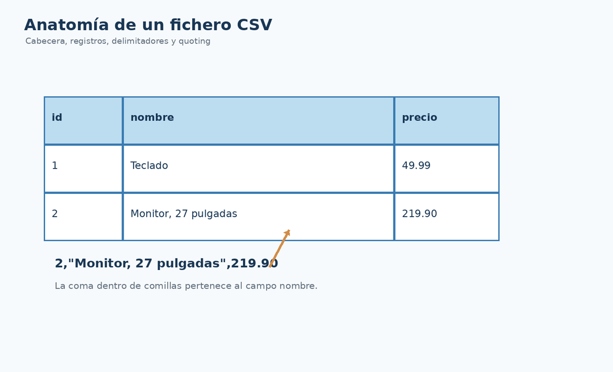

# El formato CSV

## Qué vas a conseguir

- Reconocer la estructura de un fichero CSV.
- Diferenciar delimitador, cabecera, registro y campo.
- Entender por qué un CSV real no debe procesarse con `split(",")`.

## Punto de partida

CSV parece un formato sencillo porque cada línea suele representar un registro. La dificultad aparece cuando un campo contiene el mismo carácter que usamos como delimitador.



## Conceptos clave

```csv
id,nombre,precio
1,Teclado,49.99
2,"Monitor, 27 pulgadas",219.90
```

La segunda fila contiene **tres separadores de columna**, pero la coma dentro de `"Monitor, 27 pulgadas"` pertenece al texto del campo. Las comillas forman parte del dialecto CSV y permiten representar datos que contienen delimitadores, saltos de línea o comillas.

<div class="cla-note"><strong>Idea importante</strong><p>CSV no es simplemente “texto separado por comas”. Es un formato tabular con reglas de quoting y escape.</p></div>

## Ejemplo mínimo con Java

Antes de incorporar una biblioteca puedes leer el fichero como texto para observar su contenido:

```java
Path path = Path.of("data/productos.csv");
Files.readAllLines(path, StandardCharsets.UTF_8)
        .forEach(System.out::println);
```

Este código **lee líneas**, pero todavía no interpreta correctamente la sintaxis CSV.

## Ejercicios propuestos

1. Crea `productos.csv` con cabecera y tres productos.
2. Añade un producto cuyo nombre contenga una coma.
3. Explica por qué `line.split(",")` deja de ser fiable.

## Qué debes recordar

- El fichero es texto; el CSV añade estructura.
- Las comillas cambian el significado del delimitador.
- En la siguiente lección delegaremos estas reglas en Apache Commons CSV.

<div class="cla-lesson-nav">
  <a href="/ficheros/leccion06/">← 6 · Modelo común Producto</a>
  <a href="/ficheros/leccion08/">8 · Apache Commons CSV →</a>
</div>
