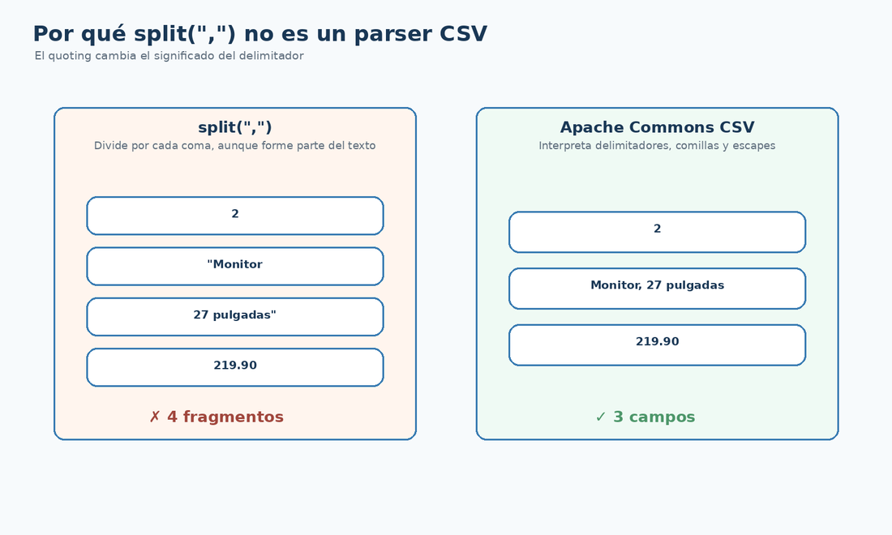

# Apache Commons CSV con Maven

## Qué vas a conseguir

- Añadir Commons CSV al `pom.xml`.
- Comprobar que Maven resuelve la dependencia.
- Diferenciar `CSVParser`, `CSVRecord` y `CSVPrinter`.

<figure class="cla-diagram cla-diagram--small">
  
  <figcaption>Un parser CSV interpreta comillas, delimitadores y campos correctamente.</figcaption>
</figure>

## Añadir la biblioteca

```xml
<properties>
  <commons-csv.version>1.11.0</commons-csv.version>
</properties>

<dependencies>
  <dependency>
    <groupId>org.apache.commons</groupId>
    <artifactId>commons-csv</artifactId>
    <version>${commons-csv.version}</version>
  </dependency>
</dependencies>
```

Después puedes verificar la resolución con:

```bash
mvn dependency:tree
```

## Las tres piezas que utilizaremos

- `CSVParser`: recorre un documento CSV.
- `CSVRecord`: representa un registro ya interpretado.
- `CSVPrinter`: escribe registros respetando el dialecto CSV.

```java
CSVFormat format = CSVFormat.DEFAULT.builder()
        .setHeader()
        .setSkipHeaderRecord(true)
        .get();
```

<div class="cla-note"><strong>Maven + API</strong><p>Maven incorpora Commons CSV; <code>CSVFormat</code>, <code>CSVParser</code> y <code>CSVPrinter</code> son las clases que utilizamos desde Java.</p></div>

<div class="cla-lesson-nav">
  <a href="/ficheros/leccion07/">← 07 · Anterior</a>
  <a href="/ficheros/leccion09/">09 · Siguiente →</a>
</div>
