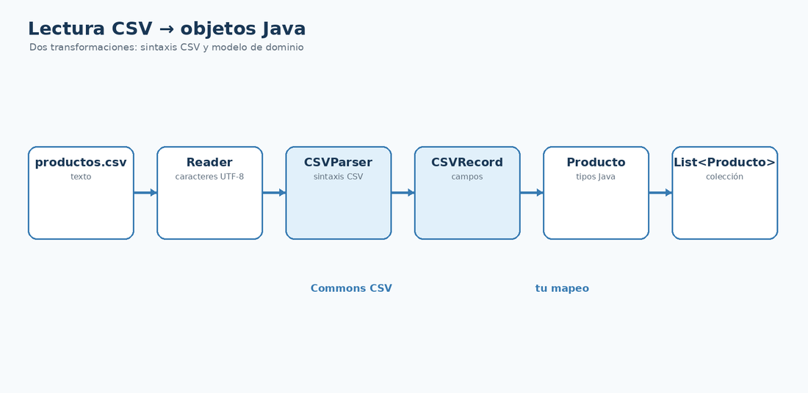

# Leer CSV a objetos Java

## Qué vas a conseguir

- Convertir `CSVRecord` en `Producto`.
- Separar parsing CSV de conversión de tipos.
- Construir `List<Producto>` a partir de un fichero.



## Mapeo de una fila

```java
private static Producto toProducto(CSVRecord record) {
    return new Producto(
            Long.parseLong(record.get("id")),
            record.get("nombre"),
            Double.parseDouble(record.get("precio")))
    );
}
```

## Lectura completa

```java
static List<Producto> readAll(Path path) throws IOException {
    CSVFormat format = CSVFormat.DEFAULT.builder()
            .setHeader()
            .setSkipHeaderRecord(true)
            .get();

    List<Producto> productos = new ArrayList<>();

    try (Reader reader = Files.newBufferedReader(path, StandardCharsets.UTF_8);
         CSVParser parser = format.parse(reader)) {
        for (CSVRecord record : parser) {
            productos.add(toProducto(record));
        }
    }
    return productos;
}
```

## Dónde validar

El parser no sabe si un precio negativo es válido. Esa regla pertenece a tu aplicación o al modelo. Conviene distinguir errores de **formato** de errores de **negocio**.

## Ejercicios propuestos

1. Añade control de filas con `stock` no numérico.
2. Decide qué hacer con una fila vacía.
3. Imprime los productos después del mapeo para comprobar los tipos.

<div class="cla-lesson-nav">
  <a href="/ficheros/leccion08/">← 8 · Apache Commons CSV</a>
  <a href="/ficheros/leccion10/">10 · Escribir objetos a CSV →</a>
</div>
