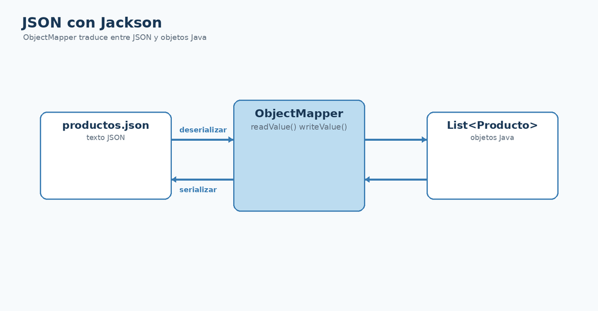

# Jackson Databind con Maven y ObjectMapper

## Qué vas a conseguir

- Añadir Jackson Databind al `pom.xml`.
- Crear un `ObjectMapper`.
- Relacionar serialización y deserialización con objetos Java.

<figure class="cla-diagram cla-diagram--small">
  
  <figcaption>Jackson transforma JSON y objetos Java en ambos sentidos.</figcaption>
</figure>

## Dependencia Maven

```xml
<properties>
  <jackson.version>2.21.3</jackson.version>
</properties>

<dependency>
  <groupId>com.fasterxml.jackson.core</groupId>
  <artifactId>jackson-databind</artifactId>
  <version>${jackson.version}</version>
</dependency>
```

## Primera instancia

```java
ObjectMapper mapper = new ObjectMapper();
```

`ObjectMapper` será la pieza central de `JsonCrudDemo` y, posteriormente, de `ProductoJsonRepository`.

<div class="cla-note"><strong>Evolución del pom.xml</strong><p>Commons CSV sigue presente. Ahora añadimos Jackson porque aparece una nueva necesidad tecnológica, no porque el repositorio lo exija.</p></div>

<div class="cla-lesson-nav">
  <a href="/ficheros/leccion17/">← 17 · Anterior</a>
  <a href="/ficheros/leccion19/">19 · Siguiente →</a>
</div>
