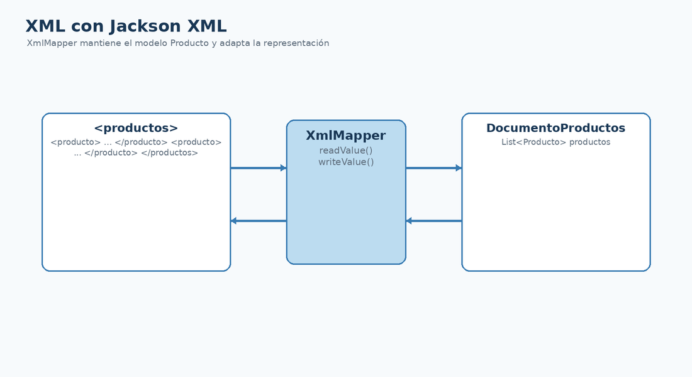

# Jackson XML con Maven y XmlMapper

## Qué vas a conseguir

- Añadir `jackson-dataformat-xml` con Maven.
- Utilizar `XmlMapper` con el mismo modelo `Producto`.
- Entender cuándo puede ser útil un wrapper de documento.

<figure class="cla-diagram cla-diagram--small">
  
  <figcaption>XmlMapper aplica el modelo de Jackson al formato XML.</figcaption>
</figure>

## Dependencia Maven

```xml
<dependency>
  <groupId>com.fasterxml.jackson.dataformat</groupId>
  <artifactId>jackson-dataformat-xml</artifactId>
  <version>${jackson.version}</version>
</dependency>
```

Utilizamos la misma propiedad `jackson.version` declarada al incorporar Databind.

```java
XmlMapper mapper = new XmlMapper();
```

## Documento con colección

```java
public record DocumentoProductos(List<Producto> productos) {}
```

Según la forma del XML, pueden ser necesarias anotaciones como `@JacksonXmlElementWrapper` o `@JacksonXmlProperty`.

<div class="cla-note"><strong>Misma familia</strong><p><code>ObjectMapper</code> y <code>XmlMapper</code> comparten muchas ideas porque ambos pertenecen al ecosistema Jackson.</p></div>

<div class="cla-lesson-nav">
  <a href="/ficheros/leccion23/">← 23 · Anterior</a>
  <a href="/ficheros/leccion25/">25 · Siguiente →</a>
</div>
