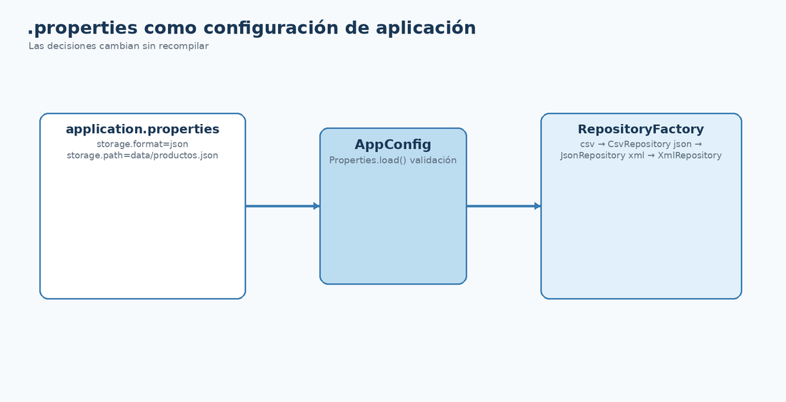

# `.properties`: configurar la implementación

## Por qué aparece ahora

Después de disponer de varias implementaciones surge una nueva pregunta: ¿por qué recompilar o modificar `main` para cambiar de CSV a JSON o XML?

```properties
repository.type=json
repository.file=data/productos.json
```

<figure class="cla-diagram cla-diagram--small">
  
  <figcaption>La configuración decide el formato y la ruta; la aplicación continúa trabajando contra el contrato del repositorio.</figcaption>
</figure>

## Leer configuración

```java
Properties properties = new Properties();
try (Reader reader = Files.newBufferedReader(Path.of("application.properties"))) {
    properties.load(reader);
}

String type = properties.getProperty("repository.type");
Path path = Path.of(properties.getProperty("repository.file"));
```

## Seleccionar la implementación

```java
Repository<Producto, Long> repository = switch (type) {
    case "csv" -> new ProductoCsvRepository(path);
    case "json" -> new ProductoJsonRepository(path);
    case "xml" -> new ProductoXmlRepository(path);
    default -> throw new IllegalArgumentException("Formato no soportado: " + type);
};
```

Esta selección puede extraerse posteriormente a una factoría. Esa nueva clase volvería a ser una **distribución de responsabilidad**: sacar de `main` la creación de implementaciones.

<div class="cla-lesson-nav"><a href="/ficheros/leccion31/">← 31 · Vehiculo</a><a href="/ficheros/leccion33/">33 · DataBridge →</a></div>
