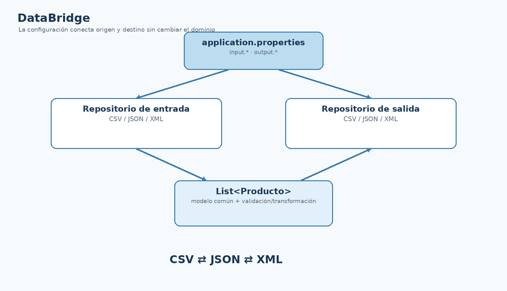

# Proyecto final: DataBridge

## Objetivo

DataBridge reúne toda la ruta: ficheros, Maven, Commons CSV, Jackson, refactorización, repositorios genéricos y configuración externa.

<figure class="cla-diagram cla-diagram--wide">
  
  <figcaption>DataBridge selecciona la persistencia mediante configuración y mantiene estable el código que consume el repositorio.</figcaption>
</figure>

## Requisitos mínimos

1. Cargar `application.properties`.
2. Seleccionar CSV, JSON o XML.
3. Instanciar la implementación correspondiente.
4. Ejecutar operaciones CRUD mediante `Repository<Producto, Long>` o `ProductoRepository`.
5. Permitir transformar datos de un formato a otro sin modificar el modelo de dominio.

## Historia completa de la refactorización

```text
CsvCrudDemo / JsonCrudDemo / XmlCrudDemo
             ↓
      detectar repetición
             ↓
ProductoRepository + clases por responsabilidad
             ↓
      IRepository<T, ID>
             ↓
 Producto / Vehiculo
             ↓
     application.properties
             ↓
          DataBridge
```

La arquitectura final no sustituye el aprendizaje de las demos: **se construye a partir de ellas**.

<div class="cla-lesson-nav"><a href="/ficheros/leccion32/">← 32 · .properties</a><a href="/ficheros/leccion34/">34 · Retos y ampliaciones →</a></div>
